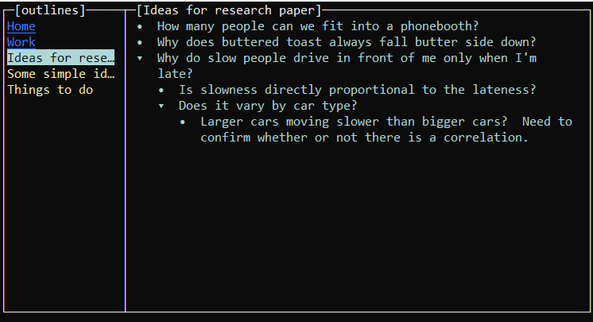

# GV 

## A Simple Console-Based Outliner

`gv` is an outliner that runs in a console window.  It's not a text editor, but it does primarily deal with the management of text.  It's not a word processor, but it does try to nicely format your outline for you.  It's an outliner first and foremost, designed to quickly create, edit and manage lots of outlines.

<p align="center">

</p>

Outlines are a great way to structure your notes and lists.  I find it my natural method of tracking information for work or my personal life.  Sure, you can use any old text editor these days to create a bulleted list, but it's not an *outline*.  Outlines are designed to be created non-linearly.  As ideas flow, outline sections should be free to move around while you clarify your thoughts.  An outline is fluid, not static.  It's inherently non-linear, helping you to categorize and encapsulate concepts into structures.  gv was designed to make it easier to work with outlines as a collection of text objects (instead of just sequential text created as a list).

## Getting Started

Either build `gv` from source (see below) or download a pre-built binary release.  `gv` is a single binary executable and can run anywhere.

```bash
$ ./gv
```

The first time `gv` starts, it will create a default configuration file in `$HOME/.gv`.  It will also create a directory `$HOME/.gv/outlines` where all of your outlines will be stored.  If you wish to put this information somewhere else, set `GVHOME` to a writable directory and `gv` will use that instead of `$HOME/.gv`.  All of your Outlines are stored individually as plain JSON files.

The `gv` screen is split into two parts- an Organizer on the left side and the Editor taking up the rest of the right hand side.  The Organizer lists all Outlines and Folders (directories) being managed.  The Editor is where you work on your Outlines.  Use the `ESC` key to toggle back and forth between the Organizer and the Editor.

The traditional control key sequences are available, CTRL-S to save, CTRL-Q to quit, etc.  Use `F1` to get a pop-up help box.

When you close `gv` it remembers which Outline you were last working on.  The next time you run `gv` it will have that Outline open for you automatically.

### gv config

`gv` maintains its configuration in `$HOME/.gv/gv.conf`.

Colors can be specified in the configuration file.  The names of colors must come from the [tcell ColorNames map](https://github.com/gdamore/tcell/blob/f4d402906fa3d330545365abbf970c048e677b35/color.go#L842).

## Compiling gv

gv requires golang 1.16 or higher.  It has very few dependencies by design and uses the excellent [gdamore/tcell](https://github.com/gdamore/tcell) library to handle the screen management.

```bash
$ go mod download
$ go build -o gv *.go
$ ./gv
```

## Getting Help

Found a bug?  Have an idea for an enhancement?  Feel free to create an issue (or better yet submit a pull request).  Please note that `gv` was built for my own personal use.  While I hope someone else finds it useful I can't promise I'll fix your bug or implement your idea.  This software is offered AS-IS with no warranty whatsoever. 


